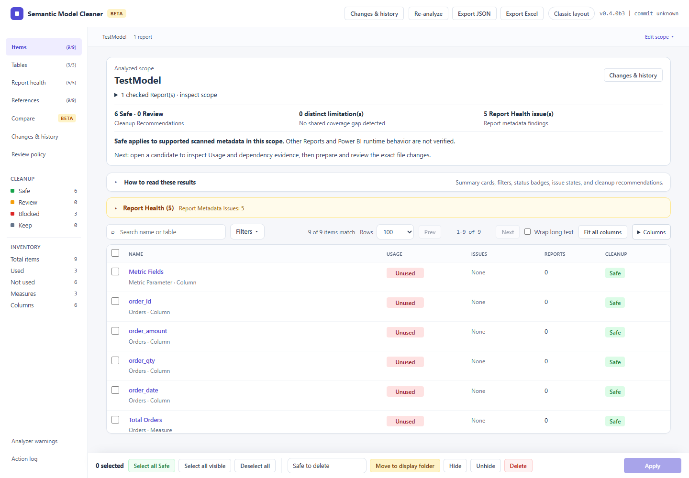

# Windows quick start

Use a disposable copy or Git branch containing one TMDL `.SemanticModel` and its connected PBIR `.Report` folders. Analysis runs locally without Power BI Desktop, an account, or Fabric.

Download [0.4.0b7 public beta](https://github.com/MrPerfectH/Semantic-Model-Cleaner/releases/tag/v0.4.0b7). The steps below cover its first analysis and reviewed recovery workflow. See the [release notes](releases/0.4.0b7.md).

1. Download the versioned Windows ZIP and its `.sha256` sidecar from the same release. Compare the ZIP's SHA-256 with the sidecar (`Get-FileHash <zip-path> -Algorithm SHA256`).
2. Extract the **complete ZIP**. Keep the EXE and adjacent files together, then run `Semantic Model Cleaner.exe`. No Python installation is required. The beta is unsigned; Windows reputation prompts vary by machine.
3. Choose **Try demo** for a disposable example, or **Open Power BI Project**. Choose a Semantic Model explicitly if several are found. Separate model/report locations are supported through the folder controls.
4. Review selected and excluded Reports, then select **Analyze**. Other Reports may use the same items. Read **Analysis Limitations** separately from **Report Health**.
5. Open an item and inspect its Usage, definition and dependencies. **Safe** applies only to supported scanned metadata in this scope. It does not establish runtime equivalence or absence of external consumers.
6. Prepare a Cleanup Action and review the exact file differences before applying. A changed input invalidates its saved preview; create a fresh plan instead of forcing it.
7. Open **Changes & history**, choose **Verify files**, and review restoration when needed. Restore recovers saved original bytes and refuses conflicting later edits. Preserve the app's user-data directory containing plans and receipts.



If the browser does not open, use the URL printed by the launcher. Port 5001 is preferred; a busy port causes fallback to another port. Keep the launcher running while using the app.

## Starting from PBIX

PBIX binaries are not supported inputs. In Power BI Desktop, save a copy as a Power BI Project (`.pbip`) using TMDL for the Semantic Model and the enhanced PBIR Report format. Existing project formats may need conversion in Desktop. Confirm that the resulting folders contain TMDL definitions and the Report's expanded `definition/` metadata. Keep the original PBIX. See Microsoft's [Power BI Projects documentation](https://learn.microsoft.com/power-bi/developer/projects/projects-overview) for current format settings.

## CLI and AI automation

Download the wheel from the same release and install it using Python 3.11 or newer. The Windows GUI EXE is a launcher; CLI commands come from the Python package.

```powershell
python -m pip install .\semantic_model_cleaner-0.4.0b7-py3-none-any.whl
smc --version
smc --help
smc "C:\Projects\Example" --format json -o "C:\Exports\analysis.json"
smc check "C:\Projects\Example" --format json
```

Keep exports outside the selected model/report artifacts. `smc check` exits 0 for a passing gate, 1 for findings, and 2 for invalid input or execution failure. Parse stdout as UTF-8 JSON and inspect the exit code. Use the [complete disposable plan/diff/apply/verify/restore example](cli/README.md#disposable-windows-workflow) for reviewed automation. Static analysis never authorizes an AI agent to skip change review.

## Getting help

Include version, selected scope, input format, exact error, and a small synthetic reproduction in an issue. Remove private paths, model expressions, credentials and report data before sharing. See [support boundaries](support.md) and [security reporting](../SECURITY.md).
